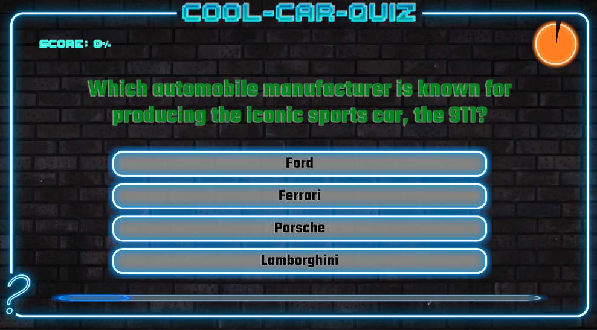
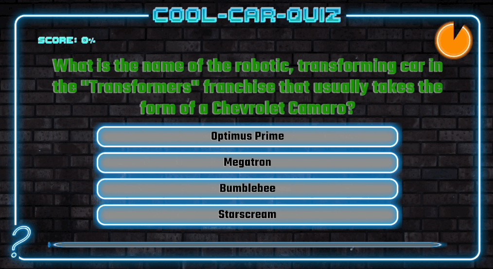
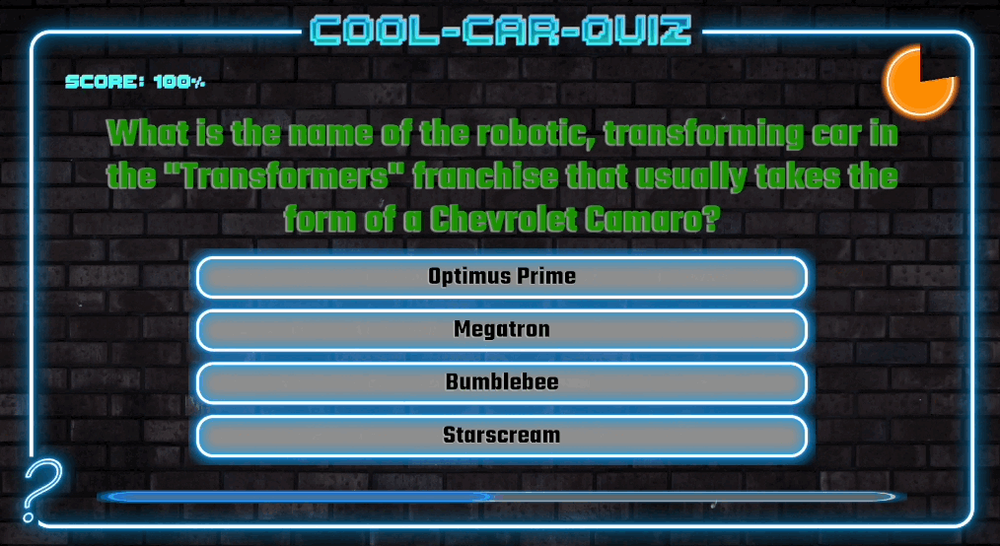

My Third Unity 2D game
# Quiz Master

## About The Game
Description:
Car Trivia Master is an engaging and educational 2D quiz game developed in Unity and scripted in C#. It takes players on an exhilarating journey through the fascinating world of automobiles, blending history and pop culture trivia. This game is designed for car enthusiasts and trivia lovers alike, offering a unique platform to test and expand their knowledge about cars.

## Key Features:

Engaging Content: Dive into a diverse pool of questions encompassing car history, iconic models, and memorable moments in automotive pop culture.

Interactive Gameplay: Choose from multiple-choice answers using responsive buttons, making the game accessible and easy to navigate.

Dynamic Timer: Each question is timed, adding an exciting challenge as players race against the clock to answer.

Progress Tracking: A slider bar visually represents the player's progress through the current set of questions, enhancing the user experience.

Scoring System: Keep track of your knowledge prowess with a scoring system that rewards correct answers.

Levels and Replayability: The game offers various levels of difficulty and a 'play again' option for endless fun and learning.

Aesthetic Appeal: Enjoy a visually appealing interface with carefully selected fonts and background images that complement the automotive theme.

Cross-Platform Compatibility: Developed in Unity, the game is designed for cross-platform play, ensuring a broad audience can enjoy it.gaming experience.

## Controls
-** Click to answer the question

## Initial Load

## Answer Correctly

## Answer wrong or No Answer

## Result and play again

## Authors
- **Kevin Yang** - *Initial work* - [kevinYang0612](https://github.com/kevinYang0612)
